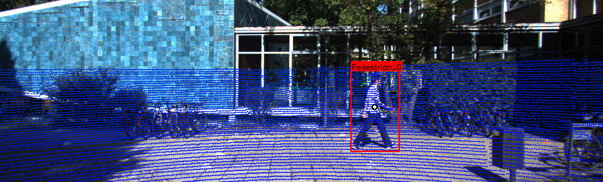
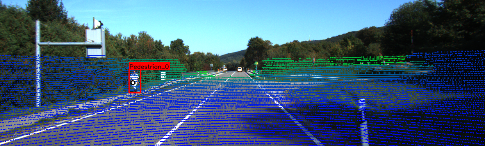
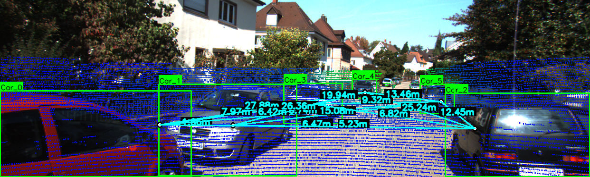

# Part B: Sensor Fusion – Camera & LiDAR Association (KITTI)

## Problem Statement

**Part B: Sensor Fusion (The "Brain")**

Demonstrate **Early or Late fusion** by associating **2D bounding boxes from the camera** with the **3D LiDAR point cloud** provided in the dataset.

### Goal
For every detected object in a video frame, estimate its **distance (depth) in meters**.

### Deliverable
- Draw the **2D bounding box** on the image
- Overlay the **estimated distance** (example: `Car_0: 12.5m`)
- Use LiDAR depth information associated with each 2D object

---

## Fusion Type

This implementation follows **Late Fusion**:
- Camera detections provide **2D bounding boxes**
- LiDAR provides **3D spatial depth**
- Fusion is performed by mapping LiDAR points into the camera image and associating them with 2D boxes

---

## Fusion Logic Explanation

### Coordinate Systems Used

| Coordinate Frame | Description |
|-----------------|-------------|
| LiDAR (Velodyne) | Raw 3D point cloud `(x, y, z)` |
| Camera | Rectified camera coordinate system |
| Image | 2D pixel space `(u, v)` |

---

### 1. LiDAR → Camera Transformation

LiDAR points are transformed into the camera coordinate frame using KITTI calibration data.

Used matrices:
- `Tr_velo_to_cam` (3×4): LiDAR to camera transformation
- `R0_rect` (3×3): Rectification matrix

Combined into a single 4×4 matrix:

T_cam = R0_rect × Tr_velo_to_cam


Each LiDAR point is converted to homogeneous coordinates:

[X, Y, Z, 1]ᵀ


and multiplied by `T_cam`.

---

### 2. Camera → Image Projection

Camera intrinsics are extracted from `P2`:

K = P2[:, :3]


Projection equations:

u = fx * (X / Z) + cx
v = fy * (Y / Z) + cy


Only points with `Z > 0` are retained.

---

### 3. Associating LiDAR Points with 2D Bounding Boxes

For each object:
1. Project all LiDAR points into image space
2. Filter points that lie within the 2D bounding box
3. These points represent the 3D surface of the object

---

### 4. Object Distance Estimation

The object center is estimated using the **median** of associated LiDAR points:

center = median(X, Y, Z)


Median is used to reduce noise and suppress outliers.

Distance is computed using Euclidean norm:

distance = || center ||


---

### 5. Visualization

For each frame:
- 2D bounding boxes are drawn
- Object centers are projected onto the image
- Distance values are overlaid in meters
- Optional distance lines between objects are drawn

Example overlay:

Car_0: 12.48m
Pedestrian_1: 8.32m


---

## Repository Structure

├── main.py
├── README.md
├── outputs/
│ ├── overlay_with_distances_000000.png
│ ├── overlay_with_distances_000001.png
│ └── ...


---

## How to Run

### Dataset Structure (KITTI)

Update dataset path in `main.py`:

```python
BASE_PATH = "/kaggle/input/kitti-3d-object-detection-dataset/training"

Run:

python main.py

## Results

### Frame 000000


### Frame 000005


### Frame 000008


### Frame 000014


Summary

Late fusion of camera and LiDAR data

Accurate 3D distance estimation using real LiDAR points

Proper use of KITTI calibration and coordinate transformations

Robust object depth estimation via median-based LiDAR center
